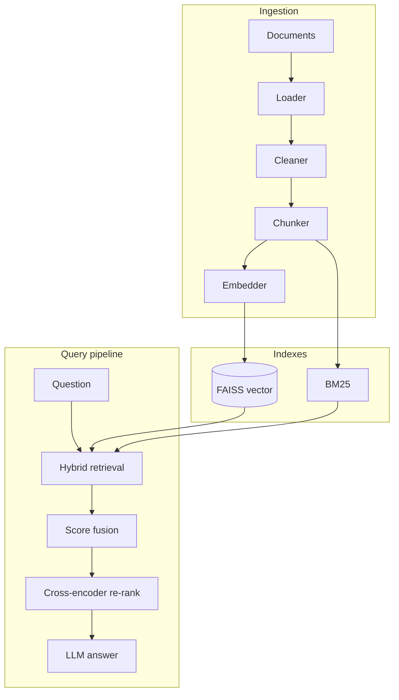

# Production-Grade Hybrid RAG System

Modular **hybrid retrieval** stack (dense + BM25 + cross-encoder re-ranking), **grounded generation** with citations and a **confidence** heuristic, **evaluation** over labeled queries, a **FastAPI** backend, and a **Streamlit retrieval dashboard** (not a chat UI).

## Architecture



## Hybrid search

1. **Vector**: top-`k` cosine similarity via `sentence-transformers` embeddings and **FAISS** `IndexFlatIP` (L2-normalized vectors ⇒ cosine).
2. **BM25**: lexical scores with `rank_bm25` over the same chunk corpus.
3. **Normalization**: per-query min–max normalization of vector and BM25 score maps (missing branch treated as 0 after fusion inputs are built per candidate set).
4. **Fusion**: for each candidate chunk id,  
   `fused = α · vector_norm + (1 − α) · bm25_norm`  
   with configurable **α** (`FUSION_ALPHA` or per-request in the API / dashboard).

## Re-ranking

The top fused candidates (default 20) are re-scored with a **cross-encoder** (`cross-encoder/ms-marco-MiniLM-L-6-v2` by default). The LLM receives the **top 5** passages after re-ranking (configurable). Re-ranking improves precision when lexical and dense signals disagree.

## Evaluation methodology

- **Retrieval**: labeled queries in `data/eval_dataset.json` use `relevant_doc_ids` (stable ids you assign at ingest time). All chunks from those documents are treated as relevant for **Precision@k**, **Recall@k**, and **MRR@k**.
- **Comparison**: same metrics are reported for **vector-only**, **hybrid (no re-rank)**, and **hybrid + re-rank**.
- **Hallucination rate (proxy)**: fraction of answers whose token overlap (max Jaccard vs. any retrieved context chunk) falls below a threshold—useful for regression tracking, not a substitute for human eval.

## Confidence score

`confidence_score` combines normalized **cross-encoder** scores on the selected contexts, **lexical grounding** of the answer against those contexts, and a small bonus for having multiple sources—clamped to `[0, 1]`. It is deterministic given the same retrieval and answer.

## Setup

```bash
cd Production-Grade-Rag
python -m venv .venv
.venv\Scripts\activate   # Windows
pip install -r requirements.txt
copy .env.example .env    # set OPENAI_API_KEY
```

### Ingest sample docs (stable doc ids for evaluation)

Use the dashboard or API and set **doc_id** to match `data/eval_dataset.json`:

- `employee-handbook` ← `data/sample_docs/employee-handbook.md`
- `security-overview` ← `data/sample_docs/security-overview.md`

### Run backend

```bash
uvicorn api.main:app --reload
```

### Run Streamlit retrieval dashboard

```bash
set RAG_API_URL=http://127.0.0.1:8000
streamlit run ui/streamlit_dashboard.py
```

The UI is a **retrieval lab**: ingestion stats, fusion α and top-k sliders, a **debug table** (Vector / BM25 / Fused / Rerank), final answer + sources + confidence, and **evaluation** charts.

## API

| Method | Path | Description |
|--------|------|-------------|
| GET | `/health` | Liveness |
| POST | `/ingest` | Multipart file + `chunking_strategy`, `chunk_size`, `chunk_overlap`, optional `doc_id` |
| POST | `/query` | JSON `QueryRequest` → answer, sources, confidence, `retrieval_debug` |
| POST | `/evaluate?k=5` | Run labeled eval; returns metrics + method comparison |

### Example `POST /query`

```json
{
  "question": "How far in advance must I request PTO?",
  "top_k_retrieval": 20,
  "alpha": 0.5,
  "use_reranker": true,
  "llm_top_k": 5
}
```

### Sample queries (after ingesting sample docs)

- “How far in advance must I request PTO?”
- “Which weekdays are mandatory in-office for hybrid staff?”
- “MFA requirement for contractors and renewal”

## Performance comparison example

After running **Run evaluation** in the dashboard (or `POST /evaluate`), compare the bar chart: hybrid + re-rank typically improves **Precision@k** and **MRR** over vector-only when queries mix keywords and paraphrases; exact numbers depend on corpus size and labels.

## Tests

```bash
pytest
```

## Configuration

| Variable | Role |
|----------|------|
| `OPENAI_API_KEY` | LLM generation |
| `VECTOR_BACKEND` | `faiss` (default); Pinecone reserved for extension |
| `PINECONE_*`, `ELASTICSEARCH_URL` | Optional / future integrations (see `.env.example`) |
| `EMBEDDING_MODEL`, `RERANKER_MODEL`, `LLM_MODEL` | Model ids |

## Project layout

- `ingestion/` — load, clean, chunk, embed  
- `retrieval/` — FAISS, BM25, fusion, hybrid orchestration, cross-encoder  
- `generation/` — OpenAI client, grounded prompt, citations, confidence  
- `evaluation/` — IR metrics, hallucination proxy, runner  
- `api/` — FastAPI + shared `RagService`  
- `ui/streamlit_dashboard.py` — retrieval engineering UI  
- `data/sample_docs/` — sample markdown  
- `data/eval_dataset.json` — labeled evaluation queries  

## Logging

Structured console logging via `logging` (level `LOG_LEVEL`). Ingestion and index rebuilds log chunk counts and model ids.

## Constraints honored

- No chat bubbles or conversational memory in the dashboard.  
- Emphasis on **retrieval transparency** (score table + raw score arrays).  
- Modular packages and configurable **α**, top-k, and re-rank toggle.
